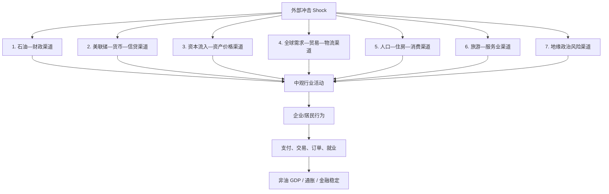

# 阿联酋高频经济监测：传导框架与公开数据源

> 核验日期：2026-08-11
> 仅保留：**有明确传导位置 + 公开可访问 + 2026 年仍在更新**的数据源。
> 频率以日度/月度为主；“在线”表示可公开查看但未提供稳定 bulk download，需要自行定期保存快照。

---

## 1. 总体框架图



核心逻辑：

```text
外部冲击
→ 金融/财政/贸易/人口等传导渠道
→ 房地产、建筑、贸易、旅游、金融等中观行业
→ 企业和居民行为
→ 订单、交易、支付、就业等微观高频数据
→ GDP、通胀、金融稳定等宏观结果
```

---

# 2. 传导链 1：石油 → 财政 → 非油经济

```text
Brent / Murban / UAE Oil Production
→ 石油收入
→ 政府财政能力 / 政府银行存款
→ 政府投资与支出
→ 建筑、基建、服务业
→ 企业订单 / 支付 / 就业
→ Non-oil GDP
```

| 高频指标 | 频率 | 公开数据/下载地址 |
|---|---:|---|
| Brent 原油价格 | 日度 | https://fred.stlouisfed.org/series/DCOILBRENTEU |
| UAE 原油/液体燃料产量 | 月度 | https://www.eia.gov/opendata/ |
| UAE active rig count | 月度 | https://rigcount.bakerhughes.com/intl-rig-count |
| Government deposits（政府存款） | 月度 | https://www.centralbank.ae/en/research-and-statistics/latest-statistics/ |
| Credit to Government / GREs | 月度 | https://www.centralbank.ae/en/research-and-statistics/latest-statistics/ |
| UAE PMI – New Orders / Output / Employment | 月度 | https://www.pmi.spglobal.com/Public/Release/PressReleases |
| Customer Transfers / Bank Transfers | 月度 | https://www.centralbank.ae/en/research-and-statistics/latest-statistics/ |

---

# 3. 传导链 2：Fed → CBUAE → EIBOR → 信贷 → 国内需求

```text
Fed Funds
→ CBUAE Base Rate
→ EIBOR
→ 银行融资成本
→ 企业贷款 / 房贷 / 消费信贷
→ 投资 + 房地产 + 消费
→ Non-oil GDP
```

| 高频指标 | 频率 | 公开数据/下载地址 |
|---|---:|---|
| Effective Federal Funds Rate | 日度 | https://fred.stlouisfed.org/series/EFFR |
| US Treasury 2Y | 日度 | https://fred.stlouisfed.org/series/DGS2 |
| US Treasury 10Y | 日度 | https://fred.stlouisfed.org/series/DGS10 |
| CBUAE Base Rate | 事件/政策日 | https://www.centralbank.ae/en/our-operations/monetary-policy-and-domestic-markets/ |
| EIBOR 1M / 3M / 6M / 12M | 日度 | https://www.centralbank.ae/en/forex-eibor/eibor-rates/ |
| Private-sector credit | 月度 | https://www.centralbank.ae/en/research-and-statistics/latest-statistics/ |
| Real estate & construction credit | 月度 | https://www.centralbank.ae/en/research-and-statistics/latest-statistics/ |
| Personal loans | 月度 | https://www.centralbank.ae/en/research-and-statistics/latest-statistics/ |
| M1 / M2 / M3 | 月度 | https://www.centralbank.ae/en/research-and-statistics/latest-statistics/ |

---

# 4. 传导链 3：全球资本 → UAE 流动性 → 房地产/股票 → 投资

```text
Global Liquidity / Risk
→ 资本流入 UAE
→ 居民及非居民存款 / 银行外部负债
→ 信贷与资产配置
→ Dubai Real Estate + ADX + DFM
→ 建筑 / 消费 / 财富效应
→ Non-oil GDP
```

| 高频指标 | 频率 | 公开数据/下载地址 |
|---|---:|---|
| VIX | 日度 | https://fred.stlouisfed.org/series/VIXCLS |
| Broad USD Index | 日度 | https://fred.stlouisfed.org/series/DTWEXBGS |
| Non-resident deposits | 月度 | https://www.centralbank.ae/en/research-and-statistics/latest-statistics/ |
| Resident deposits | 月度 | https://www.centralbank.ae/en/research-and-statistics/latest-statistics/ |
| Banks' foreign assets / liabilities | 月度 | https://www.centralbank.ae/en/research-and-statistics/latest-statistics/ |
| DLD 房地产成交笔数 | 日度/逐笔 | https://dubailand.gov.ae/en/open-data/real-estate-data/ |
| DLD 房地产成交金额 | 日度/逐笔 | https://dubailand.gov.ae/en/open-data/real-estate-data/ |
| DLD 单位面积价格 | 日度/逐笔 | https://dubailand.gov.ae/en/open-data/real-estate-data/ |
| DLD Off-plan / Existing transactions | 日度/逐笔 | https://dubailand.gov.ae/en/open-data/real-estate-data/ |
| DFM General Index | 日度 | https://www.dfm.ae/the-exchange/statistics-reports/historical-data/dfmgi |
| DFM 成交额 / 成交量 / 个股价格 | 日度 | https://www.dfm.ae/the-exchange/statistics-reports/historical-data/company-prices |
| DFM Trade by Client Type | 日度/历史 | https://www.dfm.ae/the-exchange/statistics-reports/historical-data/trade-by-client-type |
| ADX FADGI / FADX15 | 日度 | https://www.adx.ae/ |
| ADX 成交额 / 成交量 / 交易笔数 | 日度 | https://www.adx.ae/Resources/Report%20Center/Overview |

---

# 5. 传导链 4：全球需求 → UAE 贸易 → 港口物流 → 企业活动

```text
Global / China / India Demand
→ UAE Imports / Exports / Re-exports
→ 港口与海运活动
→ 物流 / 批发零售 / 仓储
→ 企业订单与支付
→ Non-oil GDP
```

| 高频指标 | 频率 | 公开数据/下载地址 |
|---|---:|---|
| UAE / Dubai / Abu Dhabi port calls | 日度 | https://portwatch.imf.org/ |
| Estimated maritime trade volume | 日度 | https://portwatch.imf.org/ |
| Jebel Ali / Khalifa / Fujairah 船舶活动 | 日度 | https://portwatch.imf.org/ |
| Abu Dhabi non-oil merchandise trade | 月度 | https://scad.gov.ae/download-publications |
| UAE PMI – New Orders | 月度 | https://www.pmi.spglobal.com/Public/Release/PressReleases |
| UAE PMI – Export Orders | 月度 | https://www.pmi.spglobal.com/Public/Release/PressReleases |
| Customer Transfers | 月度 | https://www.centralbank.ae/en/research-and-statistics/latest-statistics/ |
| Bank Transfers | 月度 | https://www.centralbank.ae/en/research-and-statistics/latest-statistics/ |

---

# 6. 传导链 5：人口/迁移 → 住房 → 消费 → 服务业

```text
人口流入 / Migration
→ Housing Demand
→ 租金 + 房地产交易
→ 家庭消费
→ Retail / Transport / Restaurants / Services
→ Non-oil GDP
```

| 高频指标 | 频率 | 公开数据/下载地址 |
|---|---:|---|
| Dubai Population Clock | 近实时 | https://www.dsc.gov.ae/en-us/EServices/Pages/Display-Population-Clock.aspx |
| DLD Sale Transactions | 日度/逐笔 | https://dubailand.gov.ae/en/open-data/real-estate-data/ |
| DLD Rental / Ejari data | 日度/逐笔 | https://dubailand.gov.ae/en/open-data/real-estate-data/ |
| 房地产成交金额 / 单价 / 面积 | 日度/逐笔 | https://dubailand.gov.ae/en/open-data/real-estate-data/ |
| Personal loans | 月度 | https://www.centralbank.ae/en/research-and-statistics/latest-statistics/ |
| Customer Transfers / Cheque Clearing | 月度 | https://www.centralbank.ae/en/research-and-statistics/latest-statistics/ |

---

# 7. 传导链 6：旅游 → 酒店 → 零售/交通 → 服务业

```text
国际游客 / 商务旅行
→ Hotel Guests / Guest Nights
→ Occupancy / ADR / Hotel Prices
→ Retail + Restaurants + Transport
→ Employment + Payments
→ Non-oil GDP
```

| 高频指标 | 频率 | 公开数据/下载地址 |
|---|---:|---|
| Abu Dhabi hotel guests | 月度 | https://scad.gov.ae/download-publications |
| Abu Dhabi guest nights | 月度 | https://scad.gov.ae/download-publications |
| Hotel occupancy / establishments | 月度 | https://scad.gov.ae/download-publications |
| Abu Dhabi Hotel Price Index | 月度 | https://scad.gov.ae/download-publications |
| Dubai Tourism Performance Reports | 月度/报告 | https://www.dubaidet.gov.ae/en/research-and-insights |
| Customer Transfers / payment activity | 月度 | https://www.centralbank.ae/en/research-and-statistics/latest-statistics/ |

---

# 8. 传导链 7：地缘政治风险 → 物流冲击 / 避险资本 → UAE

```text
Regional Geopolitical Risk
        ├─→ Hormuz / Shipping Disruption
        │   → Trade & Logistics ↓
        │   → Costs ↑
        │   → Non-oil Activity ↓
        │
        └─→ Safe-haven / Capital Diversion
            → UAE Deposits ↑
            → Dubai Property / Financial Assets ↑
            → Investment & Consumption ↑
```

| 高频指标 | 频率 | 公开数据/下载地址 |
|---|---:|---|
| Strait of Hormuz vessel traffic | 日度 | https://portwatch.imf.org/ |
| Fujairah / UAE port activity | 日度 | https://portwatch.imf.org/ |
| Brent crude price | 日度 | https://fred.stlouisfed.org/series/DCOILBRENTEU |
| VIX | 日度 | https://fred.stlouisfed.org/series/VIXCLS |
| Broad USD Index | 日度 | https://fred.stlouisfed.org/series/DTWEXBGS |
| Non-resident deposits | 月度 | https://www.centralbank.ae/en/research-and-statistics/latest-statistics/ |
| Banks' foreign liabilities | 月度 | https://www.centralbank.ae/en/research-and-statistics/latest-statistics/ |
| Dubai property transactions | 日度/逐笔 | https://dubailand.gov.ae/en/open-data/real-estate-data/ |
| ADX / DFM market turnover | 日度 | https://www.adx.ae/ ; https://www.dfm.ae/the-exchange/statistics-reports/historical-data/dfmgi |

---

# 9. 核心数据源目录

| 数据机构 | 主要数据 | 入口 |
|---|---|---|
| CBUAE | EIBOR、货币、存款、信贷、银行资产负债、支付 | https://www.centralbank.ae/en/research-and-statistics/latest-statistics/ |
| CBUAE | EIBOR 历史数据 | https://www.centralbank.ae/en/forex-eibor/eibor-rates/ |
| Dubai Land Department | 房地产销售、租赁、项目、逐笔交易 CSV | https://dubailand.gov.ae/en/open-data/real-estate-data/ |
| Dubai Financial Market | 指数、价格、成交量、成交额、投资者类型 | https://www.dfm.ae/the-exchange/statistics-reports/historical-data/dfmgi |
| Abu Dhabi Securities Exchange | 指数、成交额、成交量、交易笔数 | https://www.adx.ae/Resources/Report%20Center/Overview |
| SCAD | CPI、酒店、酒店价格、非油贸易等月度数据 | https://scad.gov.ae/download-publications |
| S&P Global PMI | UAE PMI 月度新闻稿及分项 | https://www.pmi.spglobal.com/Public/Release/PressReleases |
| IMF PortWatch | 港口、船舶、海运贸易、霍尔木兹海峡 | https://portwatch.imf.org/ |
| EIA Open Data | UAE 石油生产及国际能源数据 | https://www.eia.gov/opendata/ |
| Baker Hughes | UAE / International Rig Count | https://rigcount.bakerhughes.com/intl-rig-count |
| Dubai Data & Statistics Establishment | Dubai Population Clock | https://www.dsc.gov.ae/en-us/EServices/Pages/Display-Population-Clock.aspx |
| Dubai DET | Dubai Tourism Performance | https://www.dubaidet.gov.ae/en/research-and-insights |
| FRED | Fed Funds、UST、Brent、美元指数、VIX | https://fred.stlouisfed.org/ |
