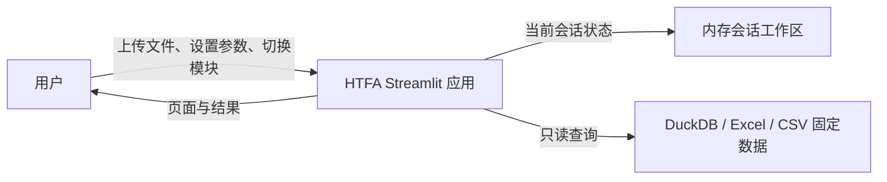
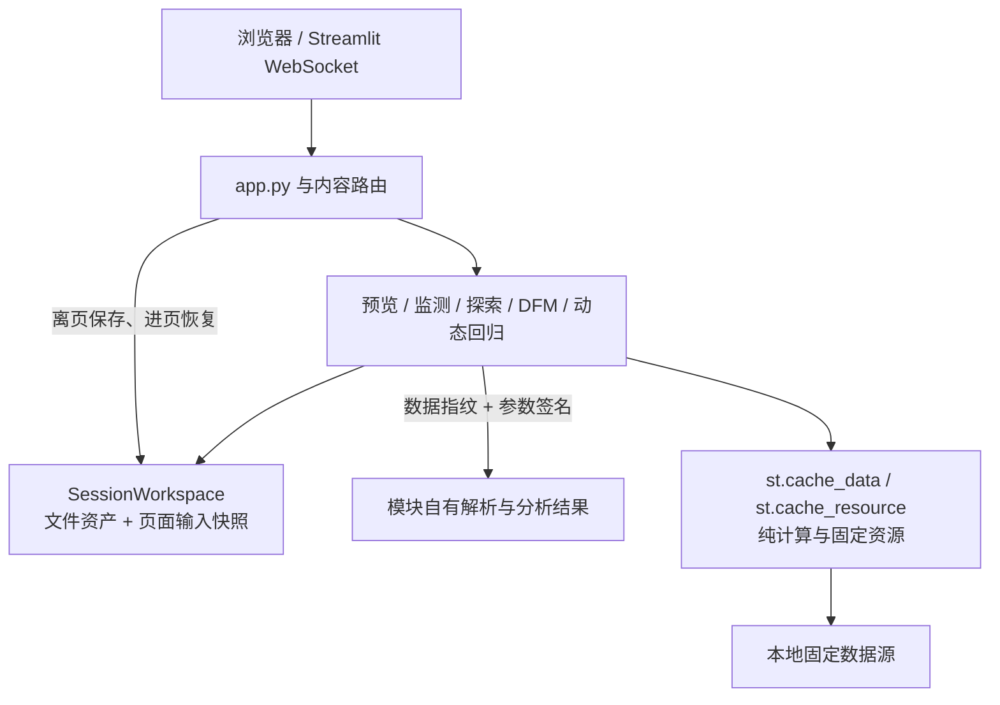

# HTFA System Session Workspace Cache Implementation Plan

> **For Claude:** REQUIRED SUB-SKILL: Use superpowers:executing-plans to implement this plan task-by-task.

**Goal:** 在当前 Streamlit 会话存活期间，统一保留 HTFA 各分析模块的上传文件和有效输入参数，并以数据指纹和参数签名精确控制派生结果失效。

**Architecture:** 新增一个不依赖 Streamlit 的轻量会话工作区内核，用于保存文件资产和页面输入快照；各模块继续拥有自己的解析结果、模型结果和业务状态。导航切换前保存当前页输入，页面控件创建前恢复输入；上传文件只有在用户明确清除或选择新文件时才变化。现有 `st.cache_data` 仅承担纯函数和固定数据的计算复用，不承担用户会话状态。

**Tech Stack:** Python 3.13、Streamlit、pandas、SHA-256、pytest、Streamlit AppTest。

---

## 1. 最终决策边界

### 1.1 本期实现

- 当前 Streamlit 会话内跨主模块、子模块和模型 Tab 保留上传文件。
- 当前会话内保留下拉框、多选框、日期范围、数值参数、模型配置和图表配置。
- 浏览器不能恢复 `file_uploader` 的文件名时，页面显示“当前会话文件”，并允许用户上传替换文件。
- 文件、工作表或读取口径变化时生成新数据指纹，清除依赖旧数据的参数快照和结果。
- 普通参数变化仅让对应结果签名失效，不清除文件和其他页面输入。
- 提供“清除当前文件”和“重置本页参数”两个显式动作。
- 保持数据预览、工业/阿联酋监测、数据探索、DFM、动态回归模型之间现有的数据边界。

### 1.2 本期不实现

- 不跨浏览器、跨设备或跨服务器重启恢复会话。
- 不把上传文件写入磁盘、DuckDB、用户数据库或临时目录。
- 不引入 Redis、数据库会话存储或后台缓存服务。
- 不自动恢复按钮点击、下载动作、表单提交、expander 展开状态、密码或认证表单。
- 不实现通用依赖图、LRU 框架或缓存监控页面。
- 不统一接管各模块已有的业务结果对象。

## 2. 架构视图

### 2.1 C4 Level 1：系统上下文



### 2.2 C4 Level 2：应用容器



### 2.3 组件职责

| 组件 | 负责 | 不负责 |
|---|---|---|
| `SessionWorkspace` | 文件 bytes、文件指纹、页面输入快照、当前页面登记 | 模型拟合、数据解析、磁盘持久化 |
| `signatures.py` | 稳定指纹、参数签名、结果有效性判断 | 清理业务状态 |
| 导航管理器 | 离开页面前触发快照 | 理解模块业务参数 |
| 各页面入口 | 声明持久化键、进页恢复、离页/渲染后保存 | 保存按钮和密码 |
| 各业务模块 | 解析、拟合、预测、精确清理依赖结果 | 实现第二套会话框架 |
| `st.cache_data/resource` | 可重算的纯函数或固定资源 | 用户输入、上传资产、模型会话结果 |

## 3. ADR-001：采用轻量会话工作区

### Context

Streamlit 在某次重跑中不再渲染 widget 时，会清理与该 widget 绑定的状态。当前模块普遍直接使用 widget key，因此切换模块后输入回到默认值；共享上传器还把 `None` 误判为用户删除文件。

### Alternatives considered

1. 各模块分别补丁：短期代码少，但会继续复制上传、恢复和失效逻辑。
2. 通用缓存平台：能力完整，但依赖图、LRU、监控和外部存储超出当前需求。
3. 轻量会话工作区：统一文件和页面输入生命周期，各模块继续管理业务结果。

### Decision

选择方案 3。公共内核只包含 `workspace.py`、`signatures.py` 和包导出文件。

### Consequences

- 页面切换行为统一，改造范围可逐模块验证。
- 结果失效仍由业务模块显式实现，避免公共层理解统计语义。
- 会话断开或服务器重启后状态消失，这是本期明确边界。

## 4. ADR-002：文件资产保存原始 bytes

### Context

`UploadedFile` 由 widget 生命周期控制；浏览器也不允许应用主动恢复上传控件。直接保存对象不能形成稳定的系统级契约。

### Alternatives considered

1. 保存 `UploadedFile` 对象。
2. 写入临时文件后保存路径。
3. 在会话中保存一份原始 bytes、文件名和 SHA-256。

### Decision

选择方案 3。解析器需要类文件对象时，按需构造带 `.name` 的 `BytesIO` 视图，不复制到磁盘。

### Consequences

- 文件不会因页面未渲染而消失。
- 每个数据槽位只保存一份原始 bytes。
- 解析后的 DataFrame 仍由各模块保存，不在公共层重复保存。

## 5. ADR-003：页面输入使用影子快照

### Context

直接依赖 widget key 无法跨未渲染页面稳定保留；保存整个 `session_state` 会混入按钮、密码、认证对象和大型结果。

### Decision

页面入口显式声明 `keys` 和必要的动态 `prefixes`。公共层仅复制这些值到 `workspace.pages.<page_id>.inputs`；恢复时只给当前不存在的 widget key赋值，不覆盖当前页正在使用的值。

### Consequences

- 持久化范围可审查、可测试。
- 新增需要保存的控件必须加入页面规范。
- 动态 DFM/SARIMAX 表格通过明确前缀保存，但按钮、下载和认证键不进入规范。

## 6. 公共接口契约

### 6.1 文件与目录

```text
dashboard/core/workspace/
├── __init__.py
├── workspace.py
└── signatures.py
```

### 6.2 `workspace.py`

实现以下最小接口；模块不直接拼装 `workspace.*` 状态键：

```python
from __future__ import annotations

from collections.abc import Iterable, MutableMapping
from dataclasses import dataclass
from io import BytesIO
from typing import Any


@dataclass(frozen=True)
class FileAsset:
    slot: str
    name: str
    content: bytes
    fingerprint: str


@dataclass(frozen=True)
class AssetUpdate:
    asset: FileAsset
    changed: bool


class NamedBytesIO(BytesIO):
    def __init__(self, content: bytes, name: str):
        super().__init__(content)
        self.name = name


class SessionWorkspace:
    def __init__(self, state: MutableMapping[str, Any]): ...

    def put_asset(self, slot: str, file_input: Any) -> AssetUpdate: ...
    def get_asset(self, slot: str) -> FileAsset | None: ...
    def open_asset(self, slot: str) -> NamedBytesIO | None: ...
    def clear_asset(self, slot: str) -> bool: ...

    def begin_page(
        self,
        page_id: str,
        *,
        keys: Iterable[str] = (),
        prefixes: Iterable[str] = (),
    ) -> None: ...
    def end_page(self, page_id: str) -> None: ...
    def snapshot_active_page(self) -> None: ...
    def reset_page(self, page_id: str) -> None: ...
```

状态键统一为：

```text
workspace.assets.<slot>
workspace.pages.<page_id>.inputs
workspace.pages.<page_id>.spec
workspace.active_page
```

约束：

- `put_asset()` 读取 `getvalue()` 或 `read()`，并恢复可 seek 对象的游标。
- 文件指纹为 `sha256(content)`；文件名作为元数据，不作为内容身份。
- 同一槽位、同一内容指纹返回 `changed=False`，不得清理任何状态。
- `snapshot_active_page()` 仅保存登记的键和前缀匹配键，不深拷贝大型对象。
- `begin_page()` 先恢复快照，再登记当前页；恢复时不得覆盖已经存在的 widget key。
- `reset_page()` 同时删除影子快照和当前存在的已登记 widget key。

### 6.3 `signatures.py`

```python
from __future__ import annotations

from datetime import date, datetime
from hashlib import sha256
from typing import Any


def stable_signature(value: Any) -> str: ...


def artifact_signature(
    *,
    data_fingerprint: str,
    parameters: Any,
    version: str,
) -> str: ...


def artifact_is_current(stored: str | None, current: str) -> bool:
    return bool(stored) and stored == current
```

`stable_signature()` 只接受 `None`、布尔值、数字、字符串、日期时间、列表/元组和字符串键映射；映射键排序后使用规范 JSON 编码。遇到未支持对象必须抛出 `TypeError`，禁止通过 `str(object)` 产生不稳定签名。

## 7. 数据槽位与页面规范

| 数据槽位 | 使用模块 | 页面 ID 示例 |
|---|---|---|
| `shared` | 阿联酋监测、数据探索、动态回归模型 | `model_analysis.sarimax`、`exploration.univariate`、`exploration.bivariate` |
| `preview.industrial` | 工业数据预览 | `preview.industrial` |
| `preview.uae` | 阿联酋数据预览 | `preview.uae` |
| `dfm.prep` | DFM 数据准备 | `model_analysis.dfm.prep` |
| `dfm.train` | DFM 模型训练 | `model_analysis.dfm.train` |

页面输入规范必须满足：

- 动态回归：复用 `WIDGET_KEYS`，但显式排除拟合、诊断、预测和下载按钮。
- `htfa/ui_shared/data_overview` 属于 HTFA 内部共享 UI，不得导入 `htfa.workspace`；由 SARIMAX 宿主把组件键登记到页面规范。
- 数据探索：保存表、变量、日期、检验参数和图表配置；不保存运行检验按钮。
- 数据预览：保存工作表、频率、指标选择和显示配置；不保存导出动作。
- DFM：保存数据准备、变量选择、训练配置、影响分解配置；动态行业键使用经过审查的前缀。
- 认证、注册、密码重置和用户管理写操作不登记为持久化页面。

## 8. 结果失效规则

| 事件 | 文件资产 | 页面输入 | 解析/模型结果 |
|---|---|---|---|
| 切换模块后返回 | 保留 | 保留 | 签名一致则保留 |
| 上传相同内容文件 | 保留 | 保留 | 保留 |
| 上传不同内容文件 | 替换 | 清除依赖该槽位的快照 | 清除依赖结果 |
| 切换 Excel 工作表/读取口径 | 保留原件，更新数据指纹 | 清除不兼容变量选择 | 清除依赖结果 |
| 修改模型参数 | 保留 | 保存新值 | 旧结果签名失效 |
| 点击“重置本页参数” | 保留 | 清除本页 | 清除本页结果 |
| 点击“清除当前文件” | 清除 | 清除依赖页面 | 清除依赖结果 |
| 服务器重启/会话结束 | 清除 | 清除 | 清除 |

## 9. 实施任务

### Task 1: 为会话工作区写纯单元测试

**Files:**

- Create: `tests/core/test_session_workspace.py`
- Test target: `dashboard/core/workspace/workspace.py`
- Test target: `dashboard/core/workspace/signatures.py`

**Steps:**

1. 写入同内容文件重复 `put_asset()` 的测试，断言第二次 `changed=False`。
2. 写入同名不同内容文件的测试，断言指纹变化且 `changed=True`。
3. 写入 `open_asset()` 测试，断言返回对象具有正确 `.name` 和原始 bytes。
4. 写入页面快照测试：保存标量、列表和 DataFrame 编辑值；删除 widget key；重新 `begin_page()` 后恢复。
5. 写入排除未登记按钮键的测试。
6. 写入 `reset_page()` 只清理目标页面的测试。
7. 写入规范签名对映射键顺序不敏感、对参数变化敏感、对未支持对象报错的测试。
8. 运行：

```powershell
runtime\python.exe -m pytest -c tooling\pytest.ini tests\core\test_session_workspace.py -q
```

**Expected:** 因公共模块尚不存在而失败，且失败点与待实现接口一致。

### Task 2: 实现最小公共内核

**Files:**

- Create: `dashboard/core/workspace/__init__.py`
- Create: `dashboard/core/workspace/workspace.py`
- Create: `dashboard/core/workspace/signatures.py`
- Test: `tests/core/test_session_workspace.py`

**Steps:**

1. 实现 `FileAsset`、`AssetUpdate`、`NamedBytesIO`。
2. 实现文件资产的存取、打开和明确清除。
3. 实现页面规范登记、离页快照、进页恢复和本页重置。
4. 实现规范 JSON 签名和结果签名组合。
5. 从 `dashboard/core/workspace/__init__.py` 只导出公共接口。
6. 重跑 Task 1 测试。

**Expected:** `tests/core/test_session_workspace.py` 全部通过；公共模块不导入 Streamlit。

### Task 3: 在导航边界保存当前页面

**Files:**

- Modify: `dashboard/core/backend/navigation/manager.py`
- Modify: `dashboard/core/ui/components/content_router.py`
- Create or modify: `tests/core/test_navigation_workspace.py`

**Steps:**

1. 为主模块和子模块切换编写测试，断言更新导航键前执行当前页快照。
2. 在 `set_current_main_module()` 和 `set_current_sub_module()` 实际改变导航时调用 `SessionWorkspace(st.session_state).snapshot_active_page()`。
3. 相同导航值不得产生额外状态变更。
4. 内容路由捕获页面异常时不得清除工作区。
5. 运行：

```powershell
runtime\python.exe -m pytest -c tooling\pytest.ini tests\core\test_navigation_workspace.py tests\models\test_sarimax_boundaries.py -q
```

**Expected:** 导航与边界测试通过。

### Task 4: 修复共享上传文件的生命周期

**Files:**

- Modify: `dashboard/core/ui/utils/shared_dataset.py`
- Modify: `tests/explore/test_shared_dataset.py`
- Modify: `tests/models/test_sarimax_ui_flow.py`

**Steps:**

1. 增加测试：已有 `shared` 资产而上传器返回 `None` 时，文件和 DataFrame 不被清除。
2. 增加测试：页面显示“当前会话文件：文件名”。
3. 增加测试：只有点击“清除当前文件”才清除文件、相关页面快照和依赖结果。
4. 将共享文件原件迁移到 `SessionWorkspace` 的 `shared` 槽位；保留现有公共读取函数名称，减少调用方改动。
5. 删除 `uploaded_file is None -> clear_shared_dataset()` 行为。
6. 新上传内容指纹变化时，调用现有模块的显式清理入口，并清除依赖页面快照。
7. 同内容重新上传不得清理状态。
8. 运行：

```powershell
runtime\python.exe -m pytest -c tooling\pytest.ini tests\explore\test_shared_dataset.py tests\models\test_sarimax_ui_flow.py -q
```

**Expected:** 共享数据和动态回归 UI 测试通过。

### Task 5: 接入动态回归模型与数据概览控件

**Files:**

- Modify: `dashboard/models/SARIMAX/ui/pages/sarimax_page.py`
- Modify: `dashboard/models/SARIMAX/ui/state.py`
- Modify: `dashboard/models/SARIMAX/ui/pages/sections/__init__.py`
- Modify: `tests/models/test_sarimax_ui_flow.py`

**Steps:**

1. 从 `WIDGET_KEYS` 派生新的 `PERSISTENT_WIDGET_KEYS`，排除拟合、诊断、预测、下载按钮。
2. 在 `render_sarimax_model_page()` 创建任何 widget 前调用 `begin_page()`。
3. 使用 `try/finally`，在页面渲染完成或异常退出时调用 `end_page()`。
4. 增加“重置本页参数”按钮；按钮回调清除本页快照、当前 widget 和拟合派生结果，但保留 `shared` 文件。
5. 增加 AppTest：上传文件，设置目标变量、外生变量、训练范围、log、模型族、配置方式和阶数；切换到数据探索再返回；断言文件及参数恢复。
6. 增加 AppTest：拟合后切换模块再返回，签名一致时结果仍显示且不重新拟合。
7. 增加 AppTest：换文件后旧结果及旧变量选择消失。
8. 运行：

```powershell
runtime\python.exe -m pytest -c tooling\pytest.ini tests\models\test_sarimax_ui_flow.py tests\models\test_sarimax_boundaries.py tests\models\test_sarimax_modeling.py -q
```

**Expected:** 动态回归全部相关测试通过；`htfa/ui_shared/data_overview` 不导入领域页面或 workspace。

### Task 6: 接入数据探索与阿联酋监测

**Files:**

- Modify: `dashboard/explore/ui/dataset_context.py`
- Modify: `dashboard/explore/ui/univariate_page.py`
- Modify: `dashboard/explore/ui/bivariate_page.py`
- Modify: `dashboard/explore/ui/stationarity.py`
- Modify: `dashboard/explore/ui/multivariate_state.py`
- Modify as needed: `dashboard/analysis/uae/renderer.py`
- Modify: `tests/explore/test_multivariate_streamlit.py`
- Modify: `tests/explore/test_stationarity_streamlit.py`
- Modify or create: `tests/analysis/uae/test_session_workspace.py`

**Steps:**

1. 为单变量和多变量探索页面声明持久化键，排除执行与下载动作。
2. 页面入口使用 `begin_page()/end_page()` 包装。
3. `get_explore_dataset()` 在 `file_input is None` 时先检查 `shared` 资产，不再因当前上传 widget 缺失删除已解析数据。
4. 数据指纹不变时复用 `ExploreDataset`；变化时只清理探索结果和不兼容选择。
5. 阿联酋监测继续只读 `shared` 文件，不建立第二份文件副本。
6. 增加 AppTest：在探索页设置表、变量、日期和检验参数，切到监测/模型再返回后恢复。
7. 运行：

```powershell
runtime\python.exe -m pytest -c tooling\pytest.ini tests\explore tests\analysis\uae -q
```

**Expected:** 探索和阿联酋监测测试通过，旧结果不会在新数据下展示。

### Task 7: 接入工业与阿联酋数据预览

**Files:**

- Modify: `dashboard/preview/shared/renderer.py`
- Modify: `dashboard/preview/shared/loader.py`
- Modify: `dashboard/preview/modules/__init__.py` only if slot metadata must be exposed
- Modify: `tests/preview/test_renderer_registry.py`
- Modify or create: `tests/preview/test_session_workspace.py`

**Steps:**

1. `PreviewRenderer` 根据 `state_namespace` 映射到 `preview.industrial` 或 `preview.uae` 文件槽位。
2. 首次上传把 bytes 写入工作区；上传控件返回 `None` 时继续使用当前槽位资产。
3. 文件内容变化时清理对应预览命名空间和页面快照，不影响另一预览模块。
4. 为工作表、频率、指标和显示选项登记页面输入；导出按钮不登记。
5. 增加测试：两个预览模块文件和参数互不泄漏，切换后分别恢复。
6. 运行：

```powershell
runtime\python.exe -m pytest -c tooling\pytest.ini tests\preview -q
```

**Expected:** 预览测试通过，工业与阿联酋槽位隔离。

### Task 8: 接入 DFM 全流程

**Files:**

- Modify: `dashboard/models/DFM/prep/ui/pages/data_prep_page.py`
- Modify: `dashboard/models/DFM/prep/ui/state/prep_state.py`
- Modify: `dashboard/models/DFM/train/ui/components/file_uploader_component.py`
- Modify: `dashboard/models/DFM/train/ui/pages/model_training_page.py`
- Modify as needed: `dashboard/models/DFM/results/ui/pages/model_analysis_page.py`
- Modify as needed: `dashboard/models/DFM/decomp/ui/pages/news_analysis_page.py`
- Modify: `tests/models/test_dfm_boundaries.py`
- Create: `tests/models/test_dfm_session_workspace.py`

**Steps:**

1. 数据准备上传保存到 `dfm.prep`，训练文件保存到 `dfm.train`。
2. 把 DFM 现有“文件名 + 大小”标识替换为内容 SHA-256，防止同名同大小不同内容误命中。
3. 为数据准备参数、变量选择、训练配置和影响分解配置分别声明页面规范。
4. 动态行业选择键只登记既有 `dfm_indicators_multiselect_`、`dfm_select_all_` 等经过审查的业务前缀。
5. DFM 训练结果继续保存在现有命名空间；文件或参数签名变化时按现有阶段边界失效。
6. 增加 AppTest：DFM 数据准备、训练、结果、影响分解之间切换，以及离开模型分析再返回后，文件和配置仍在。
7. 增加测试：新文件清理旧训练结果，但不影响 `shared` 和预览槽位。
8. 运行：

```powershell
runtime\python.exe -m pytest -c tooling\pytest.ini tests\models\test_dfm_boundaries.py tests\models\test_dfm_session_workspace.py -q
```

**Expected:** DFM 状态跨页面保留，各数据槽位互不清理。

### Task 9: 审计进程级计算缓存

**Files:**

- Review and modify only when required: `dashboard/preview/shared/calculators.py`
- Review and modify only when required: `dashboard/preview/shared/tabs.py`
- Review and modify only when required: `dashboard/analysis/industrial/utils/data_loader.py`
- Review and modify only when required: `dashboard/analysis/uae/**/renderer.py`
- Create: `tests/core/test_cache_policy.py`

**Steps:**

1. 列出全部 `@st.cache_data` 和 `@st.cache_resource` 使用点，并按“固定资源”“纯计算”“用户会话结果”分类。
2. 固定资源缓存键必须包含路径参数或数据版本；设置合理 `max_entries`，文件可能更新时保留 TTL 或修改时间输入。
3. 纯计算允许保留 `st.cache_data`，前提是结果完全由参数决定且没有用户身份、权限或可变全局状态。
4. 用户输入、上传资产、模型结果不得通过进程级缓存承担生命周期；迁移到工作区或模块状态。
5. 删除计算量小于序列化/复制成本的缓存装饰器。
6. 增加静态策略测试，禁止在认证、用户管理和工作区模块上新增 `st.cache_data/resource`。
7. 运行：

```powershell
runtime\python.exe -m pytest -c tooling\pytest.ini tests\core\test_cache_policy.py tests\preview tests\analysis\industrial tests\analysis\uae -q
```

**Expected:** 缓存分类测试和相关业务测试通过；没有把用户会话数据放入全局资源缓存。

### Task 10: 全系统验证与交付

**Files:**

- Modify only if documentation is maintained there: `docs/README.md`
- Review: all files changed by Tasks 1-9

**Steps:**

1. 运行公共工作区、预览、探索、模型和监测的聚焦测试。
2. 运行完整测试套件，因为本次改动跨越导航和所有分析模块：

```powershell
runtime\python.exe -m pytest -c tooling\pytest.ini tests -q
```

3. 运行共享数据概览 UI 测试：

```powershell
runtime\python.exe -m pytest -c tooling\pytest.ini tests\ui_shared\data_overview -q
```

4. 运行语法和边界检查：

```powershell
runtime\python.exe -m compileall -q app.py dashboard components tests
git diff --check
git status --short
```

5. 启动 `scripts\start.bat` 后进行手工验收：每个数据槽位上传一个样例文件，修改关键参数，依次切换全部主模块后返回；确认文件说明、参数和有效结果均保留。
6. 结束浏览器会话或重启服务，确认系统回到新会话状态，不产生磁盘恢复文件。
7. 仅当用户明确要求提交时，在 `main` 上按任务范围暂存正式源文件和测试；不得暂存用户数据、缓存或现有无关修改。提交前遵循仓库清理与核对规范。

**Expected:** 完整测试、组件测试、compileall 和 `git diff --check` 均通过；AppTest 与人工流程证明跨模块保留、精确失效和明确清除三个契约。

## 10. 验收标准

- 用户上传文件并设置参数后，切换任意分析模块再返回，文件仍可用，关键输入恢复。
- 上传控件显示为空不代表文件被删除；界面明确显示当前会话文件。
- 同内容重新上传不会清理结果；不同内容替换会清理依赖的输入和结果。
- 不同数据槽位之间不发生文件或状态串扰。
- 任何结果展示前都校验数据指纹和参数签名。
- 按钮、下载、密码、认证对象不进入页面输入快照。
- 公共工作区不依赖 Streamlit，不包含统计或模型业务逻辑。
- `htfa/ui_shared/data_overview` 继续保持不导入领域页面和 workspace。
- 当前会话之外不产生持久化文件。
- 全量测试与组件测试通过，并提醒用户修改后重启 `scripts\start.bat`。

## 11. 实施纪律

- 直接在本地 `main` 上工作，不创建分支。
- 当前工作区已有 SARIMAX 修改和未跟踪计划文件；实施时不得重置、覆盖或吸收无关改动。
- 使用测试先行方式逐任务推进；每个任务通过聚焦测试后再进入下一任务。
- 本方案是 UI 会话状态与计算缓存改造，不修改 Ts 模型或绘图能力，因此不需要先改 Ts。
- 不提交、不推送，除非用户另行明确要求。
